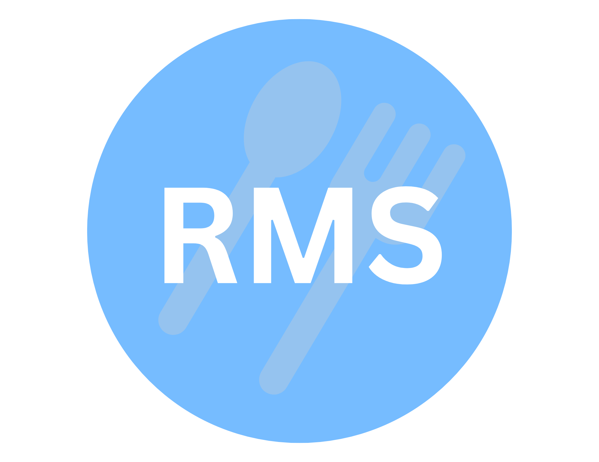

<div align = "center">
  
  <h3 align="center">Restaurant Management System (RMS) - Mobile</h3>
</div>

<!-- ABOUT THE PROJECT -->
## About The Project
Getting a server’s attention at a restaurant can be very difficult. Whether you are waiting for a spoon, a napkin, or even the bill. Servers can be very busy serving other tables and can forget about a request you have made. A customer can get frustrated waiting for a simple request, and it can potentially have a negative impact on their dining experience. Restaurant Management System (RMS) is a mobile app that aims to solve this issue and improve the dining experience for both the customer and the server. The app intends to provide faster and more efficient service.

RMS - mobile is a CSC 4996 Senior Capstone project at Wayne State University. With the idea proposed by client Dr. Seyed Mojab, the application was developed by a team of 4 Computer Science students.

* Kylie Lee (Team Lead) - https://www.linkedin.com/in/lee-kylie/
* Anthony Jones - https://www.linkedin.com/in/anthony-jones00/
* Anthony Perfetto - https://www.linkedin.com/in/anthony-perfetto-11ab461b6/
* Humayun Rahman - https://www.linkedin.com/in/humayun-rahman/

### Technologies
* Flutter v3.3 
* Dart v2.18.1
* Firebase (Database)
* Android Studio (IDE of choice)

<!-- GETTING STARTED -->
## Getting Started

### Installation
**Step 1:**

Download or clone this repo by using the link below:

```
https://github.com/kcgalee/CSC-4996-RMS-Mobile.git
```

**Step 2:**

Go to project root and execute the following command in console to get the required dependencies: 

```
flutter pub get 
```
**Step 3:**
Build on emulator that is running Android 4.4 or higher or iOS 14 or higher

### Test Account Credentials
#### Customer Account
* UN: customerKylie@gmail.com
* PW: password

#### Waiter Account
* UN: bettyWaiter@gmail.com
* PW: password

#### Manager Account
* UN: managerMike@gmail.com
* PW: password

### Navigating through the app
For customers, a QR code of a table provided by a registered restaurant must be provided. QR codes are generated within the app on the Manager side 
* Either add a table to generate a new QR code or click on any existing table tile on the "Manage Tables" page accessible from the "Manager Home" page

Below is the QR Code for Table 1 of a registered restaurant (Apple Bees) for test use


* 
